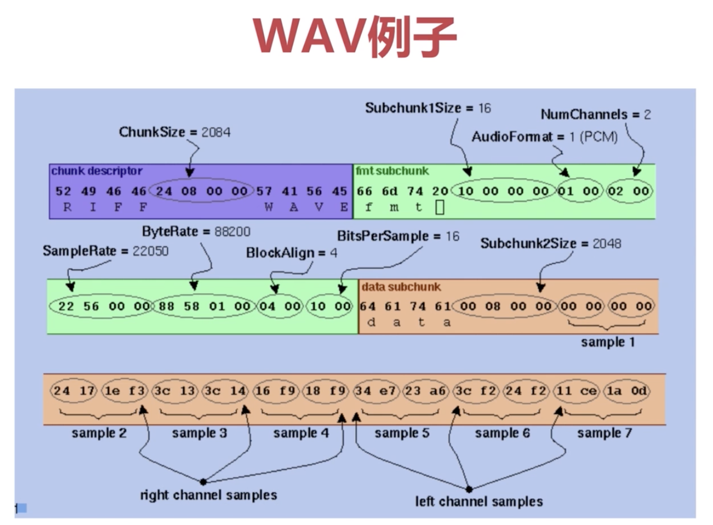

多媒体学习笔记

### 声音的三要素
1. 振频
2. 振幅
3. 谐波

### 音频采样
1. 位深 Bits Per Sample：采样大小，一个采样用多少位bit来表示
2. 采样率 Sample Rate：8k, 16k... 采样率越高，越接近模拟信号
3. 声道数 Num Channels：单声道，双声道，多声道

PCM = 采样大小 \* 采样率 \* 声道数 (Kb/s)

WAV的示例图

